## Analysis of Methylation data : +/-2kb from TSS regions 

```r
library(ggplot2)
library(reshape2)
library(xtable)
library(data.table)
library(RColorBrewer)
library(gdata)
library(gplots)
```


```r
# Colorblind Safe!  Palette for heatmaps
mypalette <- brewer.pal(name = "PiYG", n = 11)
# Palette for qualitative.
brewer.qual <- "Set2"
```


```r
setwd("/shared/silo_researcher/Gottardo_R/Sangsoon_working/Hamid_Notch/Ann_Data/rawData/Data_12_22_2012/CoreSamples/")

## log2 transfered Mvalue(=ratio of methylation to unmethylation)
TSS_2kb_Data_Total_fil <- read.table(paste("TSS_2kb/", "All_Samples_TSS_2kb_Data_Total_Filtered.txt", 
    sep = ""), header = TRUE)
BInfo <- TSS_2kb_Data_Total_fil[, 1:7]
Mvalue <- TSS_2kb_Data_Total_fil[, grep("M_value", colnames(TSS_2kb_Data_Total_fil))]

phenoType <- c("Fresh_transplant", "Fresh", "Fresh_transplant", "Fresh", "Fresh_transplant", 
    "Cultured", "Cultured", "Fresh_transplant", "Fresh", "Cultured", "Cultured_transplant", 
    "Cultured_transplant", "Cultured_transplant", "Cultured", "Cultured_transplant", 
    "Cultured", "Fresh", "Cultured", "Fresh", "Fresh", "Fresh_transplant", "Fresh", 
    "Cultured", "Cultured_transplant", "Cultured_transplant", "Fresh_transplant", 
    "Fresh_transplant", "Fresh_transplant", "Fresh_transplant")
UnitNum <- c(4, 5, 5, 3, 7, 5, 8, 6, 7, 2, 2, 8, 5, 1, 2, 6, 4, 7, 2, 1, 8, 
    8, 4, 2, 2, 4, 2, 3, 2)
sampleN <- gsub(".M_value", "", names(Mvalue))
sampleNum <- gsub("Track_", "", sampleN)
names(Mvalue) <- paste(sampleN, ".", phenoType, ".", UnitNum, sep = "")

sel <- names(Mvalue)

tempMvalue <- stack(Mvalue, select = sel)
colnames(tempMvalue) <- c("M_value", "ind")

idd <- as.data.frame(do.call("rbind", strsplit(as.character(tempMvalue$ind), 
    "\\.")))
colnames(idd) <- c("sample", "phenoType", "Unit")
rownames(idd) <- NULL
Mvalue_longShape <- data.frame(idd, tempMvalue$M_value)
names(Mvalue_longShape) <- c(colnames(idd), "M_value")

Mvalue_longShape$chr <- rep(BInfo$seqnames, length(sel))
Mvalue_longShape$start <- rep(BInfo$start, length(sel))
Mvalue_longShape$end <- rep(BInfo$end, length(sel))
Mvalue_longShape$strand <- rep(BInfo$strand, length(sel))
Mvalue_longShape$Gene <- rep(BInfo$Gene, length(sel))
Mvalue_longShape$RefSeq_ID <- rep(BInfo$RefSeq_ID, length(sel))
```


## Comparison of all phenotypes 

```r
Mvalue_longShape$phenoType <- reorder(Mvalue_longShape$phenoType, new.order = c("Fresh", 
    "Cultured", "Fresh_transplant", "Cultured_transplant"))
p <- ggplot(Mvalue_longShape, aes(phenoType, M_value), main = "All samples")
p + geom_boxplot(aes(fill = factor(phenoType)))
```

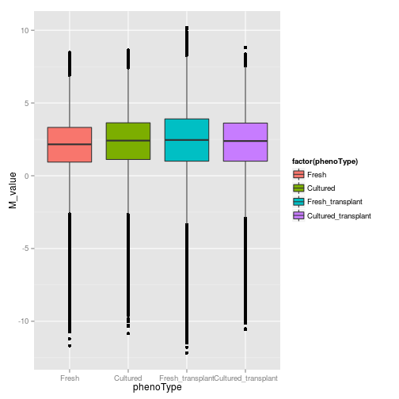 


## Comparison of all samples over the unit and phenotype 

```r
p <- ggplot(Mvalue_longShape, aes(sample, M_value), main = "All samples")
p + geom_boxplot(aes(fill = factor(phenoType))) + facet_grid(Unit ~ phenoType) + 
    theme_bw()
```

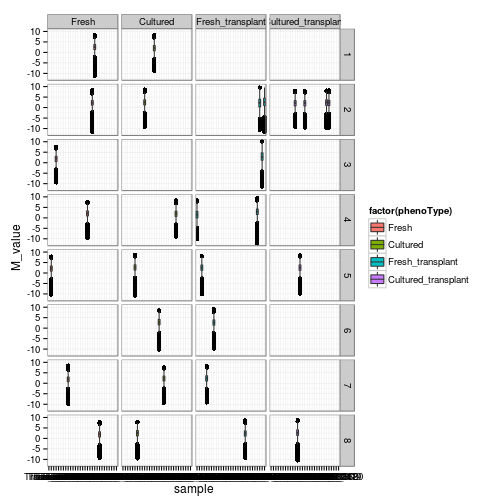 

```r

p <- ggplot(Mvalue_longShape, aes(Unit, M_value), main = "All samples")
p + geom_boxplot(aes(fill = factor(Unit)))
```

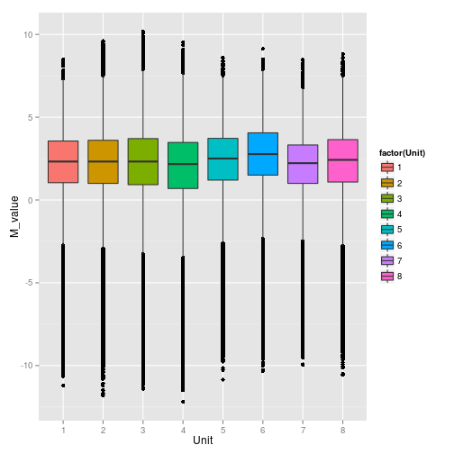 

```r

p <- ggplot(Mvalue_longShape, aes(sample, M_value), main = "All samples")
p + geom_boxplot(aes(fill = factor(Unit))) + facet_grid(Unit ~ .) + theme_bw()
```

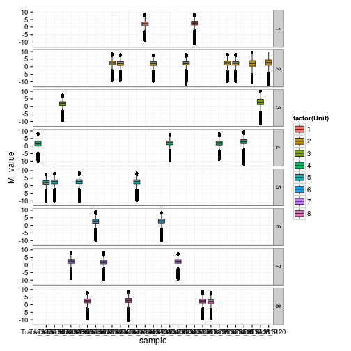 

```r

p <- ggplot(Mvalue_longShape, aes(phenoType, M_value), main = "All samples")
p + geom_boxplot(aes(fill = factor(phenoType))) + facet_grid(. ~ Unit) + theme_bw()
```

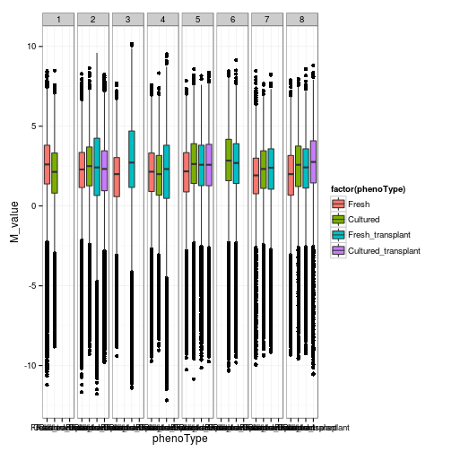 


## Comparison of Fresh and Cultured 

```r
FC_Mvalue_longShape <- subset(Mvalue_longShape, phenoType == "Fresh" | phenoType == 
    "Cultured")
p <- ggplot(FC_Mvalue_longShape, aes(phenoType, M_value), main = "Fresh vs Cultured")
p + geom_boxplot(aes(fill = factor(phenoType)))
```

 


## Comparison of Cultured and Cultured after transplant 

```r
CCT_Mvalue_longShape <- subset(Mvalue_longShape, phenoType == "Cultured" | phenoType == 
    "Cultured_transplant")
p <- ggplot(CCT_Mvalue_longShape, aes(phenoType, M_value), main = "Cultured vs Cultured after Transplant")
p + geom_boxplot(aes(fill = factor(phenoType)))
```

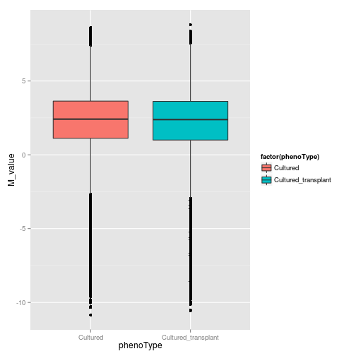 


## Comparison of Fresh after Transplant and Cultured after Transplant

```r
FTCT_Mvalue_longShape <- subset(Mvalue_longShape, phenoType == "Fresh_transplant" | 
    phenoType == "Cultured_transplant")
p <- ggplot(FTCT_Mvalue_longShape, aes(phenoType, M_value), main = "Fresh after Transplant vs Cultured after Transplant")
p + geom_boxplot(aes(fill = factor(phenoType)))
```

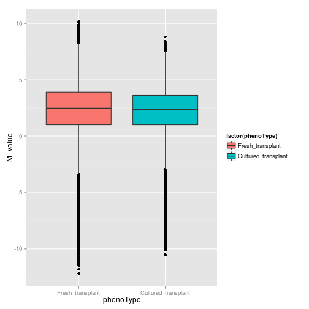 


## Statistical testing comparing Fresh to Cultured

```r
library(limma)
library("qvalue")

FCInd <- which(phenoType == "Fresh" | phenoType == "Cultured")
FC_Mvalue <- Mvalue[, FCInd]
FC_phenoType <- phenoType[FCInd]
design_FC <- model.matrix(~FC_phenoType, FC_Mvalue)
fit_FC <- lmFit(FC_Mvalue, design_FC)
fit_FC <- eBayes(fit_FC)
```

```
## Warning: Zero sample variances detected, have been offset
```

```r
topTable_FC <- topTable(fit_FC, coef = 2, number = Inf, sort = "none")
row.names(topTable_FC) <- BInfo$Gene

topTable_FC$q_value <- qvalue(topTable_FC$P.Value)$qval
topTable_FC$Chr <- BInfo$seqnames
topTable_FC$Start <- BInfo$start
topTable_FC$End <- BInfo$end
topTable_FC$Strand <- BInfo$strand
topTable_FC$RefSeq_ID <- BInfo$RefSeq_ID
topTable_FC$Gene <- BInfo$Gene

topTable_FC <- topTable_FC[order(abs(topTable_FC$t), decreasing = TRUE), ]

topTable_FC_smallP <- topTable_FC[topTable_FC$P.Value < 10^(-4), ]
xt <- xtable(topTable_FC_smallP, type = "html")
print(xt, type = "html", include.rownames = FALSE)
```

<!-- html table generated in R 3.0.1 by xtable 1.7-1 package -->
<!-- Fri Jul 19 13:31:07 2013 -->
<TABLE border=1>
<TR> <TH> logFC </TH> <TH> t </TH> <TH> P.Value </TH> <TH> adj.P.Val </TH> <TH> B </TH> <TH> q_value </TH> <TH> Chr </TH> <TH> Start </TH> <TH> End </TH> <TH> Strand </TH> <TH> RefSeq_ID </TH> <TH> Gene </TH>  </TR>
  <TR> <TD align="right"> -3.18 </TD> <TD align="right"> -8.52 </TD> <TD align="right"> 0.00 </TD> <TD align="right"> 0.00 </TD> <TD align="right"> 6.31 </TD> <TD align="right"> 0.00 </TD> <TD> chr16 </TD> <TD align="right"> 89029943 </TD> <TD align="right"> 89033943 </TD> <TD> + </TD> <TD> NM_010672 </TD> <TD> Krtap6-1 </TD> </TR>
  <TR> <TD align="right"> -3.65 </TD> <TD align="right"> -8.46 </TD> <TD align="right"> 0.00 </TD> <TD align="right"> 0.00 </TD> <TD align="right"> 6.24 </TD> <TD align="right"> 0.00 </TD> <TD> chr13 </TD> <TD align="right"> 29104282 </TD> <TD align="right"> 29108282 </TD> <TD> + </TD> <TD> NR_045077 </TD> <TD> A330102I10Rik </TD> </TR>
  <TR> <TD align="right"> -4.59 </TD> <TD align="right"> -8.00 </TD> <TD align="right"> 0.00 </TD> <TD align="right"> 0.00 </TD> <TD align="right"> 5.66 </TD> <TD align="right"> 0.00 </TD> <TD> chr5 </TD> <TD align="right"> 76372453 </TD> <TD align="right"> 76376453 </TD> <TD> - </TD> <TD> NM_010612 </TD> <TD> Kdr </TD> </TR>
  <TR> <TD align="right"> -2.56 </TD> <TD align="right"> -7.63 </TD> <TD align="right"> 0.00 </TD> <TD align="right"> 0.00 </TD> <TD align="right"> 5.18 </TD> <TD align="right"> 0.00 </TD> <TD> chr17 </TD> <TD align="right"> 7163505 </TD> <TD align="right"> 7167505 </TD> <TD> - </TD> <TD> NM_147155 </TD> <TD> Tagap1 </TD> </TR>
  <TR> <TD align="right"> -4.30 </TD> <TD align="right"> -7.25 </TD> <TD align="right"> 0.00 </TD> <TD align="right"> 0.00 </TD> <TD align="right"> 4.66 </TD> <TD align="right"> 0.00 </TD> <TD> chr5 </TD> <TD align="right"> 66252807 </TD> <TD align="right"> 66256807 </TD> <TD> + </TD> <TD> NM_001081105 </TD> <TD> Rhoh </TD> </TR>
  <TR> <TD align="right"> -3.42 </TD> <TD align="right"> -7.07 </TD> <TD align="right"> 0.00 </TD> <TD align="right"> 0.01 </TD> <TD align="right"> 4.41 </TD> <TD align="right"> 0.00 </TD> <TD> chr19 </TD> <TD align="right"> 6055751 </TD> <TD align="right"> 6059751 </TD> <TD> - </TD> <TD> NM_026246 </TD> <TD> Mrpl49 </TD> </TR>
  <TR> <TD align="right"> -2.28 </TD> <TD align="right"> -6.97 </TD> <TD align="right"> 0.00 </TD> <TD align="right"> 0.01 </TD> <TD align="right"> 4.26 </TD> <TD align="right"> 0.00 </TD> <TD> chr17 </TD> <TD align="right"> 56356312 </TD> <TD align="right"> 56360312 </TD> <TD> - </TD> <TD> NM_172624 </TD> <TD> Dpp9 </TD> </TR>
  <TR> <TD align="right"> -4.20 </TD> <TD align="right"> -6.90 </TD> <TD align="right"> 0.00 </TD> <TD align="right"> 0.01 </TD> <TD align="right"> 4.16 </TD> <TD align="right"> 0.00 </TD> <TD> chr18 </TD> <TD align="right"> 77284035 </TD> <TD align="right"> 77288035 </TD> <TD> - </TD> <TD> NM_027721 </TD> <TD> Katnal2 </TD> </TR>
  <TR> <TD align="right"> -1.73 </TD> <TD align="right"> -6.48 </TD> <TD align="right"> 0.00 </TD> <TD align="right"> 0.01 </TD> <TD align="right"> 3.53 </TD> <TD align="right"> 0.01 </TD> <TD> chr2 </TD> <TD align="right"> 25424836 </TD> <TD align="right"> 25428836 </TD> <TD> - </TD> <TD> NM_001081199 </TD> <TD> Mamdc4 </TD> </TR>
  <TR> <TD align="right"> -2.11 </TD> <TD align="right"> -6.17 </TD> <TD align="right"> 0.00 </TD> <TD align="right"> 0.01 </TD> <TD align="right"> 3.06 </TD> <TD align="right"> 0.01 </TD> <TD> chr4 </TD> <TD align="right"> 3500025 </TD> <TD align="right"> 3504025 </TD> <TD> + </TD> <TD> NM_054089 </TD> <TD> Tgs1 </TD> </TR>
  <TR> <TD align="right"> -2.43 </TD> <TD align="right"> -6.06 </TD> <TD align="right"> 0.00 </TD> <TD align="right"> 0.02 </TD> <TD align="right"> 2.88 </TD> <TD align="right"> 0.01 </TD> <TD> chr13 </TD> <TD align="right"> 48367253 </TD> <TD align="right"> 48371253 </TD> <TD> - </TD> <TD> NR_045162 </TD> <TD> A330048O09Rik </TD> </TR>
  <TR> <TD align="right"> -1.78 </TD> <TD align="right"> -5.97 </TD> <TD align="right"> 0.00 </TD> <TD align="right"> 0.02 </TD> <TD align="right"> 2.74 </TD> <TD align="right"> 0.01 </TD> <TD> chr19 </TD> <TD align="right"> 4057294 </TD> <TD align="right"> 4061294 </TD> <TD> - </TD> <TD> NM_144869 </TD> <TD> BC021614 </TD> </TR>
  <TR> <TD align="right"> -2.20 </TD> <TD align="right"> -5.97 </TD> <TD align="right"> 0.00 </TD> <TD align="right"> 0.02 </TD> <TD align="right"> 2.73 </TD> <TD align="right"> 0.01 </TD> <TD> chr5 </TD> <TD align="right"> 139062086 </TD> <TD align="right"> 139066086 </TD> <TD> + </TD> <TD> NM_183025 </TD> <TD> A430033K04Rik </TD> </TR>
  <TR> <TD align="right"> -1.75 </TD> <TD align="right"> -5.96 </TD> <TD align="right"> 0.00 </TD> <TD align="right"> 0.02 </TD> <TD align="right"> 2.72 </TD> <TD align="right"> 0.01 </TD> <TD> chr17 </TD> <TD align="right"> 33773039 </TD> <TD align="right"> 33777039 </TD> <TD> + </TD> <TD> NR_028279 </TD> <TD> Pram1 </TD> </TR>
  <TR> <TD align="right"> -3.88 </TD> <TD align="right"> -5.79 </TD> <TD align="right"> 0.00 </TD> <TD align="right"> 0.02 </TD> <TD align="right"> 2.43 </TD> <TD align="right"> 0.02 </TD> <TD> chr19 </TD> <TD align="right"> 6055966 </TD> <TD align="right"> 6059966 </TD> <TD> + </TD> <TD> NM_001190436 </TD> <TD> Fau </TD> </TR>
  <TR> <TD align="right"> -1.96 </TD> <TD align="right"> -5.76 </TD> <TD align="right"> 0.00 </TD> <TD align="right"> 0.02 </TD> <TD align="right"> 2.39 </TD> <TD align="right"> 0.02 </TD> <TD> chr1 </TD> <TD align="right"> 156046316 </TD> <TD align="right"> 156050316 </TD> <TD> + </TD> <TD> NM_001204908 </TD> <TD> Zfp648 </TD> </TR>
  <TR> <TD align="right"> -4.20 </TD> <TD align="right"> -5.71 </TD> <TD align="right"> 0.00 </TD> <TD align="right"> 0.02 </TD> <TD align="right"> 2.31 </TD> <TD align="right"> 0.02 </TD> <TD> chr1 </TD> <TD align="right"> 167088904 </TD> <TD align="right"> 167092904 </TD> <TD> - </TD> <TD> NM_032005 </TD> <TD> Tbx19 </TD> </TR>
  <TR> <TD align="right"> -2.84 </TD> <TD align="right"> -5.64 </TD> <TD align="right"> 0.00 </TD> <TD align="right"> 0.02 </TD> <TD align="right"> 2.19 </TD> <TD align="right"> 0.02 </TD> <TD> chr2 </TD> <TD align="right"> 87932123 </TD> <TD align="right"> 87936123 </TD> <TD> - </TD> <TD> NM_146641 </TD> <TD> Olfr1164 </TD> </TR>
  <TR> <TD align="right"> -1.83 </TD> <TD align="right"> -5.58 </TD> <TD align="right"> 0.00 </TD> <TD align="right"> 0.02 </TD> <TD align="right"> 2.10 </TD> <TD align="right"> 0.02 </TD> <TD> chr16 </TD> <TD align="right"> 85548618 </TD> <TD align="right"> 85552618 </TD> <TD> - </TD> <TD> NM_144853 </TD> <TD> Cyyr1 </TD> </TR>
  <TR> <TD align="right"> -2.78 </TD> <TD align="right"> -5.34 </TD> <TD align="right"> 0.00 </TD> <TD align="right"> 0.03 </TD> <TD align="right"> 1.68 </TD> <TD align="right"> 0.03 </TD> <TD> chr17 </TD> <TD align="right"> 56029515 </TD> <TD align="right"> 56033515 </TD> <TD> + </TD> <TD> NM_145490 </TD> <TD> Zfp959 </TD> </TR>
  <TR> <TD align="right"> -2.08 </TD> <TD align="right"> -5.30 </TD> <TD align="right"> 0.00 </TD> <TD align="right"> 0.03 </TD> <TD align="right"> 1.62 </TD> <TD align="right"> 0.03 </TD> <TD> chr10 </TD> <TD align="right"> 76991092 </TD> <TD align="right"> 76995092 </TD> <TD> + </TD> <TD> NM_008404 </TD> <TD> Itgb2 </TD> </TR>
   </TABLE>


## Statistical testing comparing Cultured to Cultured after transplant

```r
CCTInd <- which(phenoType == "Cultured" | phenoType == "Cultured_transplant")
CCT_Mvalue <- Mvalue[, CCTInd]
CCT_phenoType <- phenoType[CCTInd]
design_CCT <- model.matrix(~CCT_phenoType, CCT_Mvalue)
fit_CCT <- lmFit(CCT_Mvalue, design_CCT)
fit_CCT <- eBayes(fit_CCT)
```

```
## Warning: Zero sample variances detected, have been offset
```

```r
topTable_CCT <- topTable(fit_CCT, coef = 2, number = Inf, sort = "none")
row.names(topTable_CCT) <- BInfo$Gene

topTable_CCT$q_value <- qvalue(topTable_CCT$P.Value)$qval
topTable_CCT$Chr <- BInfo$seqnames
topTable_CCT$Start <- BInfo$start
topTable_CCT$End <- BInfo$end
topTable_CCT$Strand <- BInfo$strand
topTable_CCT$RefSeq_ID <- BInfo$RefSeq_ID
topTable_CCT$Gene <- BInfo$Gene

topTable_CCT <- topTable_CCT[order(abs(topTable_CCT$t), decreasing = TRUE), 
    ]

topTable_CCT_smallP <- topTable_CCT[topTable_CCT$P.Value < 10^(-4), ]
xt <- xtable(topTable_CCT_smallP, type = "html")
print(xt, type = "html", include.rownames = FALSE)
```

<!-- html table generated in R 3.0.1 by xtable 1.7-1 package -->
<!-- Fri Jul 19 13:31:08 2013 -->
<TABLE border=1>
<TR> <TH> logFC </TH> <TH> t </TH> <TH> P.Value </TH> <TH> adj.P.Val </TH> <TH> B </TH> <TH> q_value </TH> <TH> Chr </TH> <TH> Start </TH> <TH> End </TH> <TH> Strand </TH> <TH> RefSeq_ID </TH> <TH> Gene </TH>  </TR>
  <TR> <TD align="right"> -7.28 </TD> <TD align="right"> -8.77 </TD> <TD align="right"> 0.00 </TD> <TD align="right"> 0.00 </TD> <TD align="right"> 4.21 </TD> <TD align="right"> 0.00 </TD> <TD> chr11 </TD> <TD align="right"> 60266118 </TD> <TD align="right"> 60270118 </TD> <TD> + </TD> <TD> NM_021354 </TD> <TD> Drg2 </TD> </TR>
  <TR> <TD align="right"> -3.77 </TD> <TD align="right"> -6.87 </TD> <TD align="right"> 0.00 </TD> <TD align="right"> 0.03 </TD> <TD align="right"> 2.61 </TD> <TD align="right"> 0.03 </TD> <TD> chr5 </TD> <TD align="right"> 76372453 </TD> <TD align="right"> 76376453 </TD> <TD> - </TD> <TD> NM_010612 </TD> <TD> Kdr </TD> </TR>
  <TR> <TD align="right"> -2.52 </TD> <TD align="right"> -5.98 </TD> <TD align="right"> 0.00 </TD> <TD align="right"> 0.09 </TD> <TD align="right"> 1.65 </TD> <TD align="right"> 0.09 </TD> <TD> chr19 </TD> <TD align="right"> 29120392 </TD> <TD align="right"> 29124392 </TD> <TD> - </TD> <TD> NM_021299 </TD> <TD> Ak3 </TD> </TR>
  <TR> <TD align="right"> -2.79 </TD> <TD align="right"> -5.64 </TD> <TD align="right"> 0.00 </TD> <TD align="right"> 0.13 </TD> <TD align="right"> 1.26 </TD> <TD align="right"> 0.13 </TD> <TD> chr2 </TD> <TD align="right"> 28693880 </TD> <TD align="right"> 28697880 </TD> <TD> - </TD> <TD> NM_172977 </TD> <TD> Gtf3c4 </TD> </TR>
  <TR> <TD align="right"> -2.27 </TD> <TD align="right"> -5.47 </TD> <TD align="right"> 0.00 </TD> <TD align="right"> 0.14 </TD> <TD align="right"> 1.04 </TD> <TD align="right"> 0.14 </TD> <TD> chr4 </TD> <TD align="right"> 129782799 </TD> <TD align="right"> 129786799 </TD> <TD> + </TD> <TD> NM_026441 </TD> <TD> Pef1 </TD> </TR>
   </TABLE>


## Statistical testing comparing Fresh after Transplant to Cultured after transplant

```r
FTCTInd <- which(phenoType == "Fresh_transplant" | phenoType == "Cultured_transplant")
FTCT_Mvalue <- Mvalue[, FTCTInd]
FTCT_phenoType <- phenoType[FTCTInd]
design_FTCT <- model.matrix(~FTCT_phenoType, FTCT_Mvalue)
fit_FTCT <- lmFit(FTCT_Mvalue, design_FTCT)
fit_FTCT <- eBayes(fit_FTCT)
```

```
## Warning: Zero sample variances detected, have been offset
```

```r
topTable_FTCT <- topTable(fit_FTCT, coef = 2, number = Inf, sort = "none")
row.names(topTable_FTCT) <- BInfo$Gene

topTable_FTCT$q_value <- qvalue(topTable_FTCT$P.Value)$qval
topTable_FTCT$Chr <- BInfo$seqnames
topTable_FTCT$Start <- BInfo$start
topTable_FTCT$End <- BInfo$end
topTable_FTCT$Strand <- BInfo$strand
topTable_FTCT$RefSeq_ID <- BInfo$RefSeq_ID
topTable_FTCT$Gene <- BInfo$Gene

topTable_FTCT <- topTable_FTCT[order(abs(topTable_FTCT$t), decreasing = TRUE), 
    ]

topTable_FTCT_smallP <- topTable_FTCT[topTable_FTCT$P.Value < 10^(-4), ]
xt <- xtable(topTable_FTCT_smallP, type = "html")
print(xt, type = "html", include.rownames = FALSE)
```

<!-- html table generated in R 3.0.1 by xtable 1.7-1 package -->
<!-- Fri Jul 19 13:31:08 2013 -->
<TABLE border=1>
<TR> <TH> logFC </TH> <TH> t </TH> <TH> P.Value </TH> <TH> adj.P.Val </TH> <TH> B </TH> <TH> q_value </TH> <TH> Chr </TH> <TH> Start </TH> <TH> End </TH> <TH> Strand </TH> <TH> RefSeq_ID </TH> <TH> Gene </TH>  </TR>
  <TR> <TD align="right"> 2.69 </TD> <TD align="right"> 5.34 </TD> <TD align="right"> 0.00 </TD> <TD align="right"> 0.59 </TD> <TD align="right"> -4.38 </TD> <TD align="right"> 0.59 </TD> <TD> chr17 </TD> <TD align="right"> 33820403 </TD> <TD align="right"> 33824403 </TD> <TD> - </TD> <TD> NM_029804 </TD> <TD> Hnrnpm </TD> </TR>
   </TABLE>


## Comparing individual samples within each unit
## Heatmap for all samples

```r
color.palette <- mypalette
ColSideColors <- as.character(UnitNum)
ColSideColors[ColSideColors == "D3"] <- "grey80"
ColSideColors[ColSideColors == "D7"] <- "black"
MvalueM <- as.matrix(Mvalue)
hc <- hclust(dist(MvalueM), method = "ward")
dd <- as.dendrogram(hc)

## color bar on the top is for Units
heatmap.2(MvalueM, Rowv = dd, col = color.palette, breaks = seq(-2, 2, length.out = length(mypalette) + 
    1), trace = "none", ColSideColors = ColSideColors, na.color = "grey50", 
    labRow = "", labCol = sampleNum, xlab = "Samples", ylab = "Gene")
```

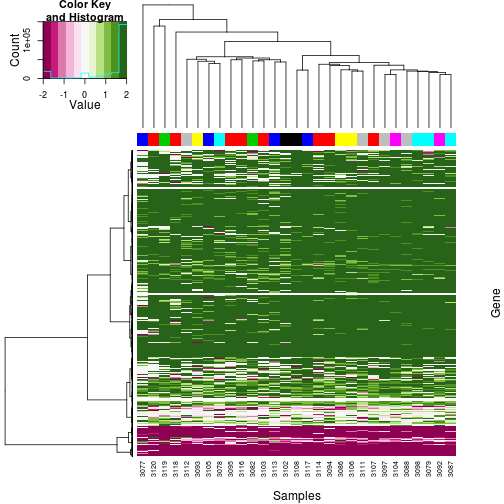 

## The signal of an individual "3077" is mostly different from other samples.

```r
SamplesCor <- cor(Mvalue)
hc <- hclust(dist(SamplesCor), method = "ward")
dd <- as.dendrogram(hc)

## color bar on the top is for Units
heatmap.2(SamplesCor, Rowv = dd, Colv = dd, col = color.palette, trace = "none", 
    ColSideColors = ColSideColors, na.color = "grey50", labRow = sampleNum, 
    labCol = sampleNum, main = "Correlation")
```

 


```r
comparison <- as.character(c("Track_3077.Fresh_transplant.4", "Track_3105.Fresh.4"))
tempM <- Mvalue[, comparison]
rownames(tempM) <- BInfo$Gene

Diff <- tempM[, 2] - tempM[, 1]
hist(abs(Diff))
abline(v = mean(abs(Diff)), col = "RED", lwd = 3)
```

 


```r
comparison <- as.character(c("Track_3078.Fresh.5", "Track_3079.Fresh_transplant.5"))
tempM <- Mvalue[, comparison]
rownames(tempM) <- BInfo$Gene

Diff <- tempM[, 2] - tempM[, 1]
hist(abs(Diff))
abline(v = mean(abs(Diff)), col = "RED", lwd = 3)
```

 

```r
tempInd <- which(abs(Diff) > 2)
```


```r
comparison <- as.character(c("Track_3078.Fresh.5", "Track_3087.Cultured.5"))
tempM <- Mvalue[, comparison]
rownames(tempM) <- BInfo$Gene

Diff <- tempM[, 2] - tempM[, 1]
hist(abs(Diff))
abline(v = mean(abs(Diff)), col = "RED", lwd = 3)
```

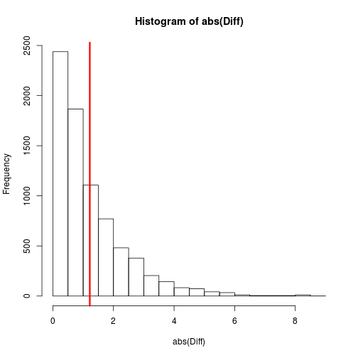 

```r
tempInd <- which(abs(Diff) > 2)
```


```r
comparison <- as.character(c("Track_3079.Fresh_transplant.5", "Track_3098.Cultured_transplant.5"))
tempM <- Mvalue[, comparison]
rownames(tempM) <- BInfo$Gene

Diff <- tempM[, 2] - tempM[, 1]
hist(abs(Diff))
abline(v = mean(abs(Diff)), col = "RED", lwd = 3)
```

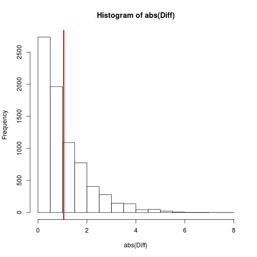 

```r
tempInd <- which(abs(Diff) > 2)

comparison <- as.character(c("Track_3082.Fresh.3", "Track_3119.Fresh_transplant.3"))
tempM <- Mvalue[, comparison]
rownames(tempM) <- BInfo$Gene

Diff <- tempM[, 2] - tempM[, 1]
hist(abs(Diff))
abline(v = mean(abs(Diff)), col = "RED", lwd = 3)
```

 

```r
tempInd <- which(abs(Diff) > 2)

comparison <- as.character(c("Track_3086.Fresh_transplant.7", "Track_3093.Fresh.7"))
tempM <- Mvalue[, comparison]
rownames(tempM) <- BInfo$Gene

Diff <- tempM[, 2] - tempM[, 1]
hist(abs(Diff))
abline(v = mean(abs(Diff)), col = "RED", lwd = 3)
```

 

```r
tempInd <- which(abs(Diff) > 2)

comparison <- as.character(c("Track_3087.Cultured.5", "Track_3098.Cultured_transplant.5"))
tempM <- Mvalue[, comparison]
rownames(tempM) <- BInfo$Gene

Diff <- tempM[, 2] - tempM[, 1]
hist(abs(Diff))
abline(v = mean(abs(Diff)), col = "RED", lwd = 3)
```

 

```r
tempInd <- which(abs(Diff) > 2)

comparison <- as.character(c("Track_3088.Cultured.8", "Track_3097.Cultured_transplant.8"))
tempM <- Mvalue[, comparison]
rownames(tempM) <- BInfo$Gene

Diff <- tempM[, 2] - tempM[, 1]
hist(abs(Diff))
abline(v = mean(abs(Diff)), col = "RED", lwd = 3)
```

 

```r
tempInd <- which(abs(Diff) > 2)

comparison <- as.character(c("Track_3088.Cultured.8", "Track_3112.Fresh.8"))
tempM <- Mvalue[, comparison]
rownames(tempM) <- BInfo$Gene

Diff <- tempM[, 2] - tempM[, 1]
hist(abs(Diff))
abline(v = mean(abs(Diff)), col = "RED", lwd = 3)
```

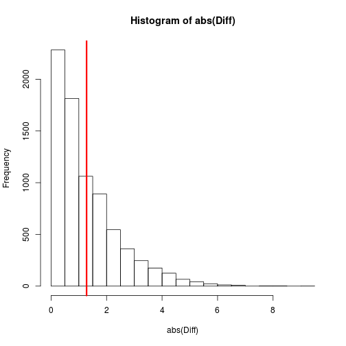 

```r
tempInd <- which(abs(Diff) > 2)

comparison <- as.character(c("Track_3093.Fresh.7", "Track_3106.Cultured.7"))
tempM <- Mvalue[, comparison]
rownames(tempM) <- BInfo$Gene

Diff <- tempM[, 2] - tempM[, 1]
hist(abs(Diff))
abline(v = mean(abs(Diff)), col = "RED", lwd = 3)
```

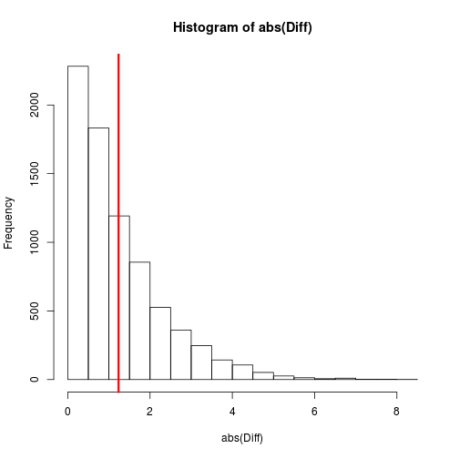 

```r
tempInd <- which(abs(Diff) > 2)

comparison <- as.character(c("Track_3097.Cultured_transplant.8", "Track_3111.Fresh_transplant.8"))
tempM <- Mvalue[, comparison]
rownames(tempM) <- BInfo$Gene

Diff <- tempM[, 2] - tempM[, 1]
hist(abs(Diff))
abline(v = mean(abs(Diff)), col = "RED", lwd = 3)
```

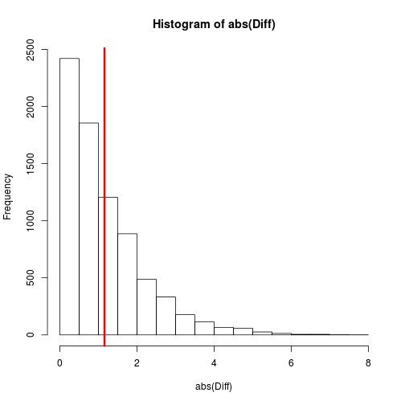 

```r
tempInd <- which(abs(Diff) > 2)

comparison <- as.character(c("Track_3102.Cultured.1", "Track_3108.Fresh.1"))
tempM <- Mvalue[, comparison]
rownames(tempM) <- BInfo$Gene

Diff <- tempM[, 2] - tempM[, 1]
hist(abs(Diff))
abline(v = mean(abs(Diff)), col = "RED", lwd = 3)
```

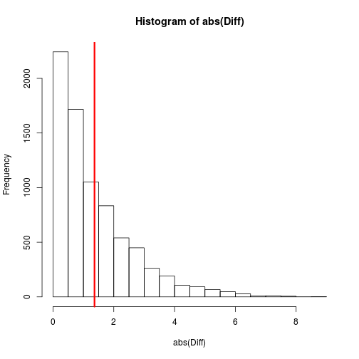 

```r
tempInd <- which(abs(Diff) > 2)

comparison <- as.character(c("Track_3113.Cultured.4", "Track_3105.Fresh.4"))
tempM <- Mvalue[, comparison]
rownames(tempM) <- BInfo$Gene

Diff <- tempM[, 2] - tempM[, 1]
hist(abs(Diff))
abline(v = mean(abs(Diff)), col = "RED", lwd = 3)
```

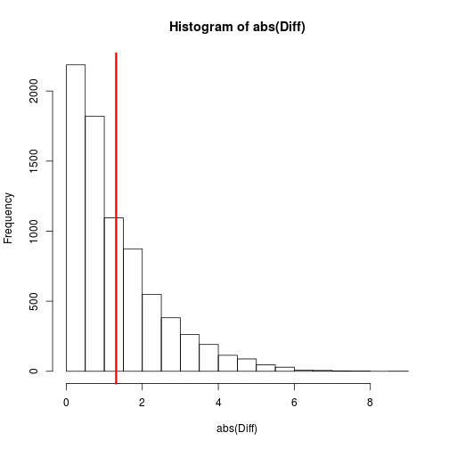 

```r
tempInd <- which(abs(Diff) > 2)

comparison <- as.character(c("Track_3117.Fresh_transplant.4", "Track_3105.Fresh.4"))
tempM <- Mvalue[, comparison]
rownames(tempM) <- BInfo$Gene

Diff <- tempM[, 2] - tempM[, 1]
hist(abs(Diff))
abline(v = mean(abs(Diff)), col = "RED", lwd = 3)
```

 

```r
tempInd <- which(abs(Diff) > 2)

comparison <- as.character(c("Track_3112.Fresh.8", "Track_3111.Fresh_transplant.8"))
tempM <- Mvalue[, comparison]
rownames(tempM) <- BInfo$Gene

Diff <- tempM[, 2] - tempM[, 1]
hist(abs(Diff))
abline(v = mean(abs(Diff)), col = "RED", lwd = 3)
```

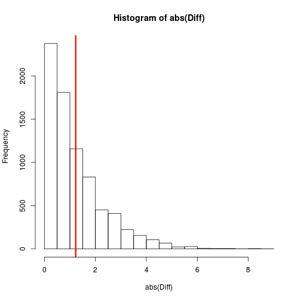 

```r
tempInd <- which(abs(Diff) > 2)
```


