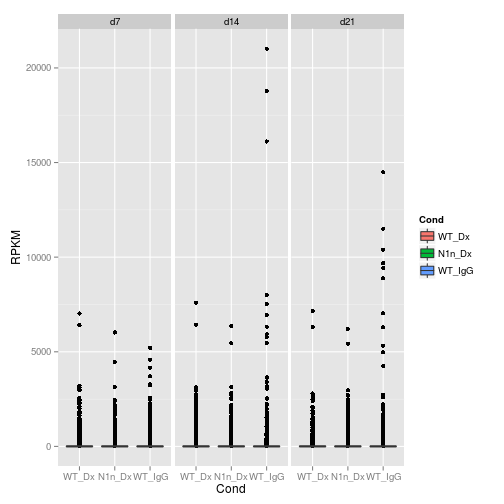
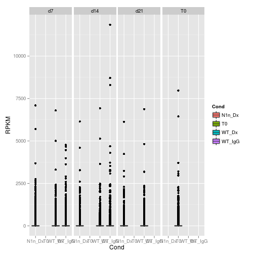
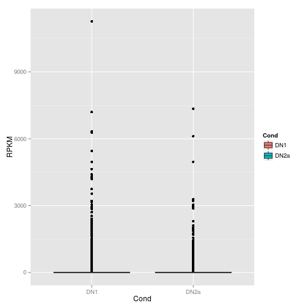

```r
library(ggplot2)
library(reshape2)
#library(xtable)
library(data.table)
library(RColorBrewer)
library(gdata)
library(gplots)
```

## Reading RPKM data sets 

```r
setwd("/shared/silo_researcher/Gottardo_R/Sangsoon_working/Hamid_Notch/Suzanne_RNA_Seq/RawData/")

keyID <- c("19208", "16184", "12501", "12502", "12500", "16197", "19373", "19374", "12503", "15205", "67122", "14462", "58208", "18109", "17869", "21414", "14357", "15213", "18128", "18129", "18131")

filename <- "total_data_exon_TimeCourse_Rep1_counts_ex_RPKM_uniqueOverlap.txt"
timecourseRep1 <- read.table(paste0("Time_course/Rep1/edgeR/", filename))
n1 <- gsub("RNA_Seq_", "", names(timecourseRep1))
n2 <- gsub("_d", ".d", n1)
names(timecourseRep1) <- paste(n2, ".1", sep="")

filename <- paste("total_data_exon_TimeCourse_Rep2_counts_ex_RPKM_uniqueOverlap.txt", sep="")
timecourseRep2 <- read.table(paste("Time_course/Rep2/edgeR/", filename, sep=""))
timecourseRep2T0 <- data.frame(timecourseRep2[, "T0"])
rownames(timecourseRep2T0) <- rownames(timecourseRep2)
names(timecourseRep2T0) <- "T0.2"

sel <- names(timecourseRep2T0)
temptimecourseT0 <- stack(timecourseRep2T0, select=sel)
colnames(temptimecourseT0) <- c("RPKM", "ind")

idd <- as.data.frame(do.call("rbind",strsplit(as.character(temptimecourseT0$ind), "\\.")))
#idd <- t(id)
colnames(idd) <- c("Day", "Rep")
rownames(idd) <- NULL
timecourseT0_longShape <- data.frame(idd, temptimecourseT0$RPKM)
names(timecourseT0_longShape) <- c(colnames(idd), "RPKM")
timecourseT0_longShape$ID <- rep(rownames(timecourseRep2T0), length(sel))
timecourseT0_longShape$key <- ifelse(timecourseT0_longShape$ID%in%keyID, 1, 0)

save(timecourseT0_longShape, file="timecourseT0_longShape_Rep2_RPKM.rda")


timecourseRep2 <- timecourseRep2[, -4]

n1 <- gsub("_d", ".d", names(timecourseRep2))
names(timecourseRep2) <- paste(n1, ".2", sep="")
timecourse <- cbind(timecourseRep1, timecourseRep2)

sel <- names(timecourse)
temptimecourse <- stack(timecourse, select=sel)
colnames(temptimecourse) <- c("RPKM", "ind")

idd <- as.data.frame(do.call("rbind",strsplit(as.character(temptimecourse$ind), "\\.")))
#idd <- t(id)
colnames(idd) <- c("Cond", "Day", "Rep")
rownames(idd) <- NULL
timecourse_longShape <- data.frame(idd, temptimecourse$RPKM)
names(timecourse_longShape) <- c(colnames(idd), "RPKM")
timecourse_longShape$ID <- rep(rownames(timecourse), length(sel))
timecourse_longShape$key <- ifelse(timecourse_longShape$ID%in%keyID, 1, 0)
timecourse_longShape$Day <- reorder(timecourse_longShape$Day, new.order=c("d7", "d14", "d21"))
timecourse_longShape$Cond <- reorder(timecourse_longShape$Cond, new.order=c("WT_Dx", "N1n_Dx", "WT_IgG"))

save(timecourse_longShape, file="timecourse_Rep1_Rep2_RPKM.rda")

filename <- paste("total_data_exon_Dosage_DN__counts_ex_RPKM_uniqueOverlap.txt", sep="")
DosageDN <- read.table(paste("Suzanne_New_RNA/edgeR/",filename, sep=""))

DNdat <- data.frame(DosageDN[, c("DN1_GTGGCC_L007", "DN2a_ACTGAT_L007")])
rownames(DNdat) <- rownames(DosageDN)
names(DNdat) <- c("DN1", "DN2a")    
  
DosageDat <- DosageDN[, -c(7,8)]
names(DosageDat) <- c("Dx_0.5_d7", "Dx_0.75_d7", "Dx_1_d7", "Dx_5_d7", "IgG_20_d7", "Jx_20_d7")

sel <- names(DosageDat)
tempDosage <- stack(DosageDat, select=sel)
colnames(tempDosage) <- c("RPKM", "ind")

idd <- as.data.frame(do.call("rbind",strsplit(as.character(tempDosage$ind), "\\_")))
#idd <- t(id)
colnames(idd) <- c("Cond", "Dosage", "Day")
rownames(idd) <- NULL
Dosage_longShape <- data.frame(idd, tempDosage$RPKM)
names(Dosage_longShape) <- c(colnames(idd), "RPKM")
Dosage_longShape$ID <- rep(rownames(DosageDat), length(sel))
Dosage_longShape$key <- ifelse(Dosage_longShape$ID%in%keyID, 1, 0)

save(Dosage_longShape, file="dosage_longShape_RPKM.rda")

sel <- names(DNdat)
tempDN <- stack(DNdat, select=sel)
colnames(tempDN) <- c("RPKM", "ind")

idd <- as.data.frame(do.call("rbind",strsplit(as.character(tempDN$ind), "\\.")))
#idd <- t(id)
colnames(idd) <- c("Cond")
rownames(idd) <- NULL
DN_longShape <- data.frame(idd, tempDN$RPKM)
names(DN_longShape) <- c(colnames(idd), "RPKM")
DN_longShape$ID <- rep(rownames(DNdat), length(sel))
DN_longShape$key <- ifelse(DN_longShape$ID%in%keyID, 1, 0)

save(DN_longShape, file="DN_longShape_RPKM.rda")
```

## Visualization for Rep1 Timecourse dat sets: Just for overall difference among Days and Conditions. 

```r

timecouse_dt <- subset(timecourse_longShape, timecourse_longShape$RPKM!=-99 & Rep==1)
#dt <- subset(timecouse_dt, Rep==1)
timecourse_key <- subset(timecouse_dt, key==1)

#keyGene <- c("Ptcra", "Il2ra", "Cd3e", "Cd3g","Cd3d", "Il7r", "Rag1", "Rag2", "Cd247", "Hes1", "Nrarp", "Gata3", "Bcl11b", "MycN", "Myc", "Tcf7", "Dtx1", "Hey1", "Notch1", "Notch2", "Notch3")
p <- ggplot()+geom_boxplot(data=timecouse_dt, aes(x=Cond, y=RPKM, fill=Cond))+facet_grid(.~Day)
p
```

 


```r
timecouse_dt <- subset(timecourse_longShape, timecourse_longShape$RPKM!=-99&Rep=="2")
#dt <- subset(timecouse_dt, Rep==1)
timecourse_key <- subset(timecouse_dt, key==1)

timecouseT0_dt <- subset(timecourseT0_longShape, timecourseT0_longShape$RPKM!=-99)
#dt <- subset(timecouse_dt, Rep==1)
timecourseT0_key <- subset(timecouseT0_dt, key==1)

p <- ggplot()+geom_boxplot(data=timecouse_dt, aes(x=Cond, y=RPKM, fill=Cond))+geom_boxplot(data=timecouseT0_dt, aes(x=Day, y=RPKM, fill=Day))+facet_grid(.~Day)
p
```

 

## Visualization for dosage data set

```r
Dosage_dt <- subset(Dosage_longShape, Cond=="Dx")
#Dosage_dt <- Dosage_longShape
Dosage_dt$Dosage <- reorder(Dosage_dt$Dosage, new.order=c("0.5", "0.75","1", "5"))
Dosage_dt <- subset(Dosage_dt, Dosage_dt$RPKM!=-99)

#dt <- subset(timecouse_dt, Rep==1)
Dosage_key <- subset(Dosage_dt, key==1)
#keyGene <- c("Ptcra", "Il2ra", "Cd3e", "Cd3g","Cd3d", "Il7r", "Rag1", "Rag2", "Cd247", "Hes1", "Nrarp", "Gata3", "Bcl11b", "MycN", "Myc", "Tcf7", "Dtx1", "Hey1", "Notch1", "Notch2", "Notch3")
Dosage_dtJx <- subset(Dosage_longShape, Cond=="Jx"|Cond=="IgG")
#Dosage_dt <- Dosage_longShape
Dosage_dtJx <- subset(Dosage_dtJx, Dosage_dtJx$RPKM!=-99)

#dt <- subset(timecouse_dt, Rep==1)
Dosage_keyJx <- subset(Dosage_dtJx, key==1)

p <- ggplot()+geom_boxplot(data=Dosage_dt, aes(x=Dosage, y=RPKM, fill=Dosage))+geom_boxplot(data=Dosage_dtJx, aes(x=Cond, y=RPKM, fill=Cond))#+facet_grid(.~Dosage)+theme_bw()
p
```

 

# Visualization for DN dat sets

```r

DN_dt <- subset(DN_longShape, DN_longShape$RPKM!=-99)
#dt <- subset(timecouse_dt, Rep==1)
DN_key <- subset(DN_dt, key==1)
#keyGene <- c("Ptcra", "Il2ra", "Cd3e", "Cd3g","Cd3d", "Il7r", "Rag1", "Rag2", "Cd247", "Hes1", "Nrarp", "Gata3", "Bcl11b", "MycN", "Myc", "Tcf7", "Dtx1", "Hey1", "Notch1", "Notch2", "Notch3")

p <- ggplot()+geom_boxplot(data=DN_dt, aes(x=Cond, y=RPKM,  fill=Cond))
p
```

 


